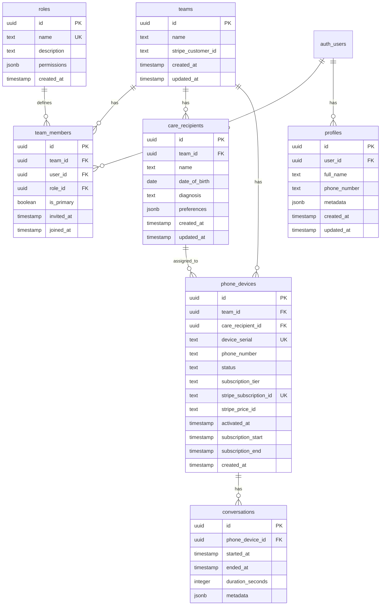

# Multi-Tenant Support for Best Day Phone

## Overview

Implement a family/household-based multi-tenant architecture where each family is an isolated tenant (called a "team"). Caregivers (primary and secondary) manage care recipients and their associated phone devices within their household team. All data will be strictly isolated using Supabase Row Level Security (RLS).

## Data Model

## Implementation Steps

### 1. Database Schema & Migrations

Create Supabase migration files in `supabase/migrations/`:

**Core Tables:**

- `teams` — Family/household tenant container (Stripe customer)
- `roles` — Defines available roles (e.g., primary_caregiver, secondary_caregiver) with permissions
- `profiles` — Extended user profile data (one-to-one with auth.users)
- `team_members` — Join table linking users to teams with a role_id
- `care_recipients` — The people receiving care
- `phone_devices` — Physical phone hardware owned by teams with individual Stripe subscriptions
- `conversations` — Call/conversation logs linked to phone devices

**Key Constraints:**

- Each team must have exactly one primary caregiver (enforce via trigger)
- Users can belong to multiple teams with different roles
- Teams can have multiple phone_devices (each with its own Stripe subscription)
- Phone_devices belong to a team (required) and can be assigned to a care_recipient (nullable)
- Each phone_device has a unique device_serial and unique stripe_subscription_id
- Each phone_device has its own subscription tier (Base WiFi, Mid, Premium 5G)
- Care_recipients can have 0 or many phone_devices assigned to them
- Conversations are linked to phone_devices, not care_recipients
- All tenant-scoped tables include `team_id` for RLS filtering

### 2. Row Level Security (RLS) Policies

Enable RLS on all tables and create policies:

**Roles:**

- `SELECT`: Public read access (roles are system-defined)
- `INSERT/UPDATE/DELETE`: Restricted to service role only

**Teams:**

- `SELECT`: Members can view their teams
- `UPDATE`: Only primary caregivers can update team settings
- `DELETE`: Prevent deletion (soft delete only)

**Team Members:**

- `SELECT`: Members can view other members in their teams
- `INSERT`: Primary caregivers can invite new members
- `UPDATE`: Primary caregivers can change roles; users can update their own join status
- `DELETE`: Primary caregivers can remove members (except themselves)

**Care Recipients:**

- `SELECT/INSERT/UPDATE/DELETE`: Team members have full access to care recipients in their team

**Phone Devices:**

- `SELECT/INSERT/UPDATE/DELETE`: Team members have full access to phone devices in their team
- Devices can be unassigned (care_recipient_id nullable) or assigned to care recipients
- Multiple devices can belong to one team

**Conversations:**

- `SELECT/INSERT/UPDATE`: Team members can access conversations for phone devices in their team
- Linked via phone_device_id, not care_recipient_id

**Profiles:**

- `SELECT/UPDATE`: Users can only access/modify their own profile

### 3. Database Functions

Create helper functions:

- `get_user_teams()` — Returns all teams the current user belongs to
- `get_user_role_in_team(team_id)` — Returns user's role in a specific team
- `is_primary_caregiver(team_id)` — Boolean check for primary caregiver status
- `create_team_with_primary(team_name, user_id)` — Atomic team creation

### 4. TypeScript Types

Create type definitions in `types/database.ts`:

- Mirror Supabase schema types
- Role type with permissions structure
- Subscription tier types (Base WiFi ~$75/mo, Mid ~$100/mo, Premium 5G ~$150/mo)
- Device status enums (inactive, active, suspended, cancelled)
- Helper types for team member with role details
- Stripe subscription status types

### 5. Application Layer Changes

**Server-Side Context:**

- Create `lib/supabase/teams.ts` with helper functions to get current team context
- Update [`lib/supabase/server.ts`](lib/supabase/server.ts) with team-aware queries

**Client-Side Context:**

- Create React Context provider for team state (`components/providers/TeamProvider.tsx`)
- Add team switcher if users belong to multiple families (rare but possible)

**Middleware Updates:**

- Update [`lib/supabase/proxy.ts`](lib/supabase/proxy.ts) to load team context into session
- Ensure RLS policies are automatically enforced (no app-layer filtering needed)

**Dashboard Updates:**

- Update [`app/dashboard/page.tsx`](app/dashboard/page.tsx) to show team-scoped data
- Update [`components/app-sidebar.tsx`](components/app-sidebar.tsx) to display team name and current user role
- Create team settings page for primary caregivers

### 6. Sign-Up Flow Changes

Update [`components/auth/sign-up-form.tsx`](components/auth/sign-up-form.tsx):

- Create team automatically on first user sign-up
- Set first user as primary caregiver
- Handle invitation flow for secondary caregivers (join existing team)

### 7. Testing Strategy

- Test RLS policies directly in Supabase SQL editor
- Verify data isolation between teams
- Test role-based permissions using the roles table
- Validate team creation and member invitation flows
- Test multiple phone devices per team (each with separate subscriptions)
- Test unassigned phone devices (no care_recipient)
- Test phone devices assigned to care_recipients
- Verify conversations are correctly linked to phone_devices
- Test subscription lifecycle (activation, renewal, cancellation)
- Verify unique constraints on stripe_subscription_id

## Files to Create

- `supabase/migrations/00001_create_teams.sql`
- `supabase/migrations/00002_create_roles.sql`
- `supabase/migrations/00003_create_profiles.sql`
- `supabase/migrations/00004_create_team_members.sql`
- `supabase/migrations/00005_create_care_recipients.sql`
- `supabase/migrations/00006_create_phone_devices.sql`
- `supabase/migrations/00007_create_conversations.sql`
- `supabase/migrations/00008_seed_roles.sql`
- `supabase/migrations/00009_rls_policies.sql`
- `supabase/migrations/00010_helper_functions.sql`
- `supabase/migrations/00011_triggers.sql`
- `types/database.ts`
- `lib/supabase/teams.ts`
- `components/providers/TeamProvider.tsx`
- `hooks/use-team.ts`
- `app/dashboard/team/settings/page.tsx`

## Key Considerations

**Security:**

- RLS is the primary security boundary — never bypass it
- Use `auth.uid()` in RLS policies, not app-layer user IDs
- Service role key should only be used for admin operations

**Scalability:**

- Index `team_id` on all tenant-scoped tables
- Consider partitioning by team for very large datasets (future optimization)

**User Experience:**

- Most caregivers belong to one team — optimize for this
- Handle edge case where user is invited to multiple families (e.g., divorced parents)
- Clear role indicators in UI (badge for primary caregiver)
- Phone-centric UI: Show devices/phones as the primary entity with associated care recipient details

**Data Migration:**

- If existing users exist, create migration script to assign them to teams
- Handle users without teams gracefully

**Data Integrity:**

- Phone devices can exist without being assigned to a care recipient (nullable foreign key)
- Multiple phone devices can be assigned to one care recipient
- Unique constraint on device_serial to prevent duplicate devices
- Use foreign key constraints with appropriate CASCADE/SET NULL behavior
- Conversations must always link to a valid phone_device
- Roles are seeded at migration time and managed via service role

**Roles & Permissions:**

- Roles table is extensible for future role types
- Initial roles: `primary_caregiver` and `secondary_caregiver`
- Permissions stored as JSONB for flexibility
- Primary caregiver has full team management permissions
- Secondary caregiver has view/interact permissions but limited admin rights

**Billing & Subscriptions:**

- Teams are Stripe customers (stripe_customer_id on teams table)
- Each phone_device has its own Stripe subscription (stripe_subscription_id on phone_devices)
- One team can have multiple active subscriptions (one per phone device)
- Subscription tiers: Base WiFi (~$75/mo), Mid (~$100/mo), Premium 5G (~$150/mo)
- Device is included free; all revenue from monthly subscriptions
- Track subscription_start and subscription_end for billing periods
- stripe_price_id links to Stripe Price object for the subscription tier
- Subscription lifecycle managed through Stripe webhooks

## Dependencies

- Existing Supabase project with auth enabled
- Supabase CLI (for running migrations)
- Current auth system (already implemented)

## Next Steps After Implementation

1. Add invitation system (email invites for secondary caregivers)
2. Implement Stripe integration:

   - Create Stripe customer when team is created
   - Create Stripe subscription when phone device is activated
   - Webhook handlers for subscription events (created, updated, cancelled, payment failed)
   - Subscription management UI (upgrade/downgrade tiers, cancel)

3. Create admin dashboard for primary caregivers
4. Add audit logs for team changes and subscription events
5. Build phone device management UI (activation, status tracking, subscription details)
6. Create conversation history viewer (linked to phone devices)
7. Implement subscription status badges and alerts (e.g., payment failed, expiring soon)