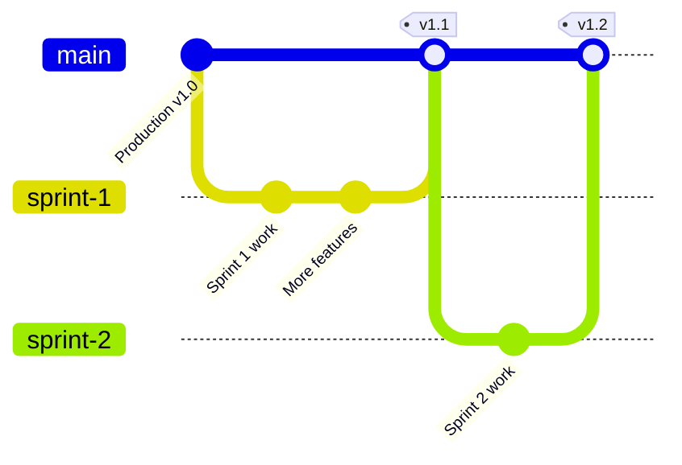
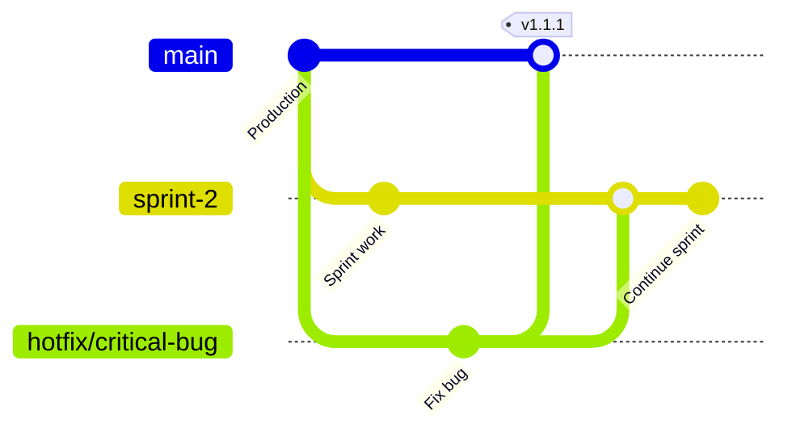

# Git Branching Strategy — Best Day Phone

## Team Context

### Team Members

| Name         | Role                              |
| ------------ | --------------------------------- |
| **Jonathan** | Project Owner and Product Manager |
| **Noah**     | Project Manager                   |
| **Jon**      | Design and Product Visionary      |
| **JR**       | Technical Lead                    |
| **Alex**     | Front-end Developer               |
| **Andy**     | Mobile App Developer              |
| **Isaiah**   | Back-end Developer                |

### Development Cadence

- **Sprint Duration:** 2 weeks
- **Repository Scope:** Web application (this repo)
- **Mobile App:** Separate repository with independent branching strategy

---

## Branch Structure

### Main Branches

#### `main`

- **Purpose:** Production-ready code
- **Protection:** Protected branch, requires PR approval
- **Deployment:** Automatically deploys to production via Vercel - https://bdp.misfitsandmachines.com

#### `sprint-N` (e.g., `sprint-1`, `sprint-2`)

- **Purpose:** Active sprint development branch
- **Lifespan:** Created at sprint start, merged to `main` at sprint end
- **Vercel:** Configured as preview branch for team visibility
- **Direct commits:** Allowed for simple-to-moderate changes

### Supporting Branches

#### Feature Branches (Optional)

- **Pattern:** `sprint-N/feature-description`
- **Example:** `sprint-1/login-redesign`, `sprint-2/pricing-selector`
- **Purpose:** Isolate complex features during development
- **Merge target:** Sprint branch (via lightweight PR)

#### Hotfix Branches

- **Pattern:** `hotfix/description`
- **Example:** `hotfix/auth-token-expiry`, `hotfix/pricing-display-bug`
- **Purpose:** Urgent production fixes outside sprint cycle
- **Merge target:** `main` first, then backport to active sprint branch

---

## Workflows

### Sprint Workflow



#### At Sprint Start

**JR performs sprint initialization:**

1. **Create sprint branch from `main`**

2. **Configure Vercel preview branch**

   - https://bdp.preview.misfitsandmachines.com

#### During Sprint

**For simple changes (small bug fixes, copy updates, minor styling):**

**For complex features (new components, significant refactors, backend integration):**

```bash
# Create feature branch off sprint branch
git checkout sprint-N
git pull origin sprint-N
git checkout -b sprint-N/feature-description

# Make changes
git add .
git commit -m "descriptive commit message"
git push -u origin sprint-N/feature-description

# Open PR: sprint-N/feature-description → sprint-N
# Request review from relevant domain lead
# After approval, merge and delete feature branch
```

**Choosing between direct commit vs feature branch:**

- Direct commit: Changes take < 1 hour, low risk, clear scope
- Feature branch: Changes take > 1 hour, need review, uncertain scope, might need iteration

#### At Sprint End

**JR performs sprint merge:**

1. **Open PR:** `sprint-N` → `main`
2. **Review checklist:**
   - Preview deployment works as expected
   - No merge conflicts with `main`
   - All team members have reviewed preview URL
   - No blocking issues or bugs
3. **Merge strategy:** Squash and merge (cleaner history)
4. **Post-merge:**
   - Verify production deployment
   - Delete sprint branch
   - Tag release: `git tag v1.N.0`

---

### Hotfix Workflow

For urgent production issues that can't wait for the next sprint merge:



#### Process

1. **Create hotfix branch from `main`**

   ```bash
   git checkout main
   git pull origin main
   git checkout -b hotfix/description
   ```

2. **Fix and test**

   ```bash
   # Make fix
   git add .
   git commit -m "fix: description of fix"
   git push -u origin hotfix/description
   ```

3. **Open expedited PR:** `hotfix/description` → `main`

   - Tag JR for immediate review
   - Include description of issue and fix
   - Reference any error logs or issue tickets

4. **After merge to `main`, backport to sprint branch**

   ```bash
   # Merge to active sprint branch to prevent conflicts
   git checkout sprint-N
   git pull origin sprint-N
   git merge main
   git push origin sprint-N
   ```

5. **Clean up**
   ```bash
   git branch -d hotfix/description
   git push origin --delete hotfix/description
   ```

---

## Branch Naming Conventions

### Sprint Branches

- **Pattern:** `sprint-N` (where N is sequential number)
- **Examples:** `sprint-1`, `sprint-2`, `sprint-15`
- **Reasoning:** Simple, clear, matches sprint planning terminology

### Feature Branches

- **Pattern:** `sprint-N/feature-description`
- **Description format:** lowercase, hyphen-separated
- **Examples:**
  - `sprint-1/login-redesign`
  - `sprint-2/pricing-selector-persistence`
  - `sprint-3/auth-activation-flow`
- **Reasoning:** Groups features by sprint, prevents branch clutter

### Hotfix Branches

- **Pattern:** `hotfix/description`
- **Description format:** lowercase, hyphen-separated, brief but descriptive
- **Examples:**
  - `hotfix/auth-token-expiry`
  - `hotfix/pricing-display-error`
  - `hotfix/sidebar-navigation-crash`
- **Reasoning:** Clearly identifies urgent fixes, distinguishable from feature work

---

## Pull Request Guidelines

### Sprint → Main

**Reviewer:** JR or relevant domain lead

**Review Criteria:**

- Preview deployment tested and working
- All sprint goals completed (or documented as deferred)
- No console errors or warnings
- Mobile responsiveness verified
- No merge conflicts

**Timeline:** Review within 1 business day of sprint end

### Feature → Sprint

**Reviewer:** Relevant domain lead or peer developer

- Front-end: Alex
- Back-end: Isaiah
- Design/UX: Jon

**Review Criteria:**

- Code follows project conventions
- Changes are scoped to the feature
- No breaking changes to sprint branch
- Basic functionality tested

**Timeline:** Review within 2 business days

### Hotfix → Main

**Reviewer:** JR

**Review Criteria:**

- Fix addresses the specific issue
- No unintended side effects
- Tested in production-like environment
- Includes plan for backport to sprint branch

**Timeline:** Expedited review within 4 hours

---

## Mobile App Repository

The mobile application (led by Andy) lives in a **separate repository** with its own branching strategy.

**Coordination Points:**

- Mobile app may consume APIs from web app backend
- Coordinate breaking API changes during sprint planning
- Mobile and web sprints are aligned but independently managed
- Cross-functional features should be discussed in sprint planning

---

## Commit Message Guidelines

### Format

```
type: brief description

Optional longer explanation of what and why (not how)
```

### Types

- `feat:` New feature
- `fix:` Bug fix
- `docs:` Documentation changes
- `style:` Formatting, missing semicolons, etc. (no code change)
- `refactor:` Code restructuring without behavior change
- `test:` Adding or updating tests
- `chore:` Maintenance tasks, dependency updates

### Examples

**Good:**

```
feat: add pricing plan persistence to local storage

Stores selected plan in localStorage so users don't lose selection
between pages. Fixes issue where plan resets on navigation.
```

**Good:**

```
fix: resolve auth token expiry redirect loop

Tokens were not being cleared on logout, causing redirect loop
on subsequent login attempts. Now properly clears all auth state.
```

**Less ideal (but acceptable for small changes):**

```
fix: typo in hero section
```

---

## FAQ

### When should I create a feature branch vs. commit directly to sprint branch?

**Create a feature branch if:**

- The work will take more than a few hours
- You want isolated testing before integrating with sprint branch
- Multiple people might work on the same feature
- The change is risky or experimental

**Commit directly to sprint branch if:**

- The change is simple and low-risk (copy updates, styling tweaks)
- You can complete the work in one sitting
- The change is immediately needed by other team members

### What if I need to make a hotfix during a sprint?

Follow the hotfix workflow. The hotfix will merge to `main` first (for immediate production deployment), then backport to the active sprint branch to keep it in sync.

### Can I create a feature branch off `main` instead of the sprint branch?

No. All development work during a sprint should branch from the sprint branch, not `main`. This ensures:

- Work is visible in the sprint preview deployment
- Changes integrate with other sprint work
- Sprint branch can be cleanly merged at sprint end

### What happens if there are merge conflicts when merging sprint to main?

This shouldn't happen often if hotfixes are properly backported. If conflicts occur:

1. Resolve conflicts locally in the sprint branch
2. Push resolution to sprint branch
3. Re-request PR review
4. Merge to `main` after approval

### How do we handle incomplete sprint work?

If a feature isn't ready at sprint end:

- **Option 1:** Remove the incomplete feature from sprint branch before merge (revert commits)
- **Option 2:** Hide feature behind feature flag, merge to main, complete in next sprint
- **Option 3:** Extend sprint by 1-2 days if feature is nearly complete (avoid if possible)

Discuss approach with Jonathan (Product Manager) and JR (Technical Lead).

---

## Rationale

This branching strategy balances several competing priorities:

### Team Collaboration

- Shared sprint branch enables team visibility and integration testing
- Preview deployments allow non-technical stakeholders to review progress
- Hybrid approach (direct commits + feature branches) provides flexibility

### Production Stability

- Protected `main` branch prevents accidental production issues
- PR review process catches bugs before production deployment
- Hotfix workflow provides emergency response capability

### Developer Experience

- Simple branch naming is easy to remember and type
- Direct commits to sprint branch reduce overhead for small changes
- Feature branches available when isolation is needed

### Stakeholder Visibility

- Vercel preview branches provide always-up-to-date demo environment
- Preview URLs shareable with entire team, including non-technical members
- No need to run local dev environment to see latest work

---

## Quick Reference

### Sprint Start (JR)

```bash
git checkout main && git pull
git checkout -b sprint-N
git push -u origin sprint-N
# Configure Vercel, share preview URL
```

### Direct Sprint Work

```bash
git checkout sprint-N && git pull
# make changes
git add . && git commit -m "type: description"
git push
```

### Feature Branch Work

```bash
git checkout sprint-N && git pull
git checkout -b sprint-N/feature-name
# make changes
git add . && git commit -m "type: description"
git push -u origin sprint-N/feature-name
# Open PR: feature-branch → sprint-N
```

### Hotfix

```bash
git checkout main && git pull
git checkout -b hotfix/description
# fix issue
git add . && git commit -m "fix: description"
git push -u origin hotfix/description
# Open PR → main, then backport to sprint-N
```

### Sprint End (JR)

```bash
# Open PR: sprint-N → main
# After approval and merge:
git checkout main && git pull
git tag v1.N.0 && git push --tags
git branch -d sprint-N
git push origin --delete sprint-N
```

---

_Last updated: January 10, 2026_
